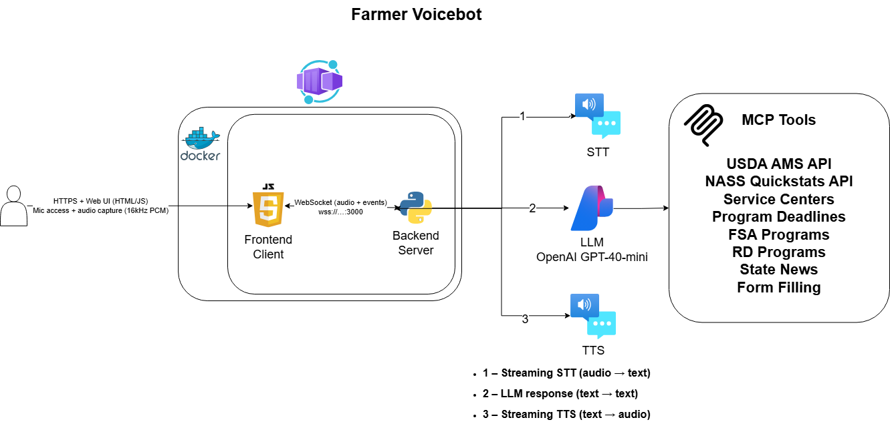

# 🎙️ USDA Farmer Voice Assistant

<div align="center">

**A Real-Time AI Voice Agent for Farmers**
*Powered by Azure OpenAI, Azure Speech, and USDA Data*

[](https://www.python.org/)
[](Dockerfile)
[](https://azure.microsoft.com/)

</div>

---

## 🏗️ Architecture



This is a **low-latency voice assistant** designed to help farmers interact with complex USDA services using natural speech. It combines real-time streaming speech processing with a powerful tool-use agent (MCP) to perform actual work.

---

## 🌟 Key Features

The bot uses the **Model Context Protocol (MCP)** to interact with real-world USDA systems:

### 📄 Dynamic Form Filling
- **Universal Filling:** Automatically reads and understands *any* PDF form dropped into the `Document/` folder (e.g., AD-2100, AD-1069).
- **Auto-Save:** Updates a "filled" copy of the PDF in real-time as the farmer speaks.
- **Smart Filtering:** Intelligent enough to skip "Office Use Only" sections.
- **Email Delivery:** Emails the completed, editable PDF directly to the farmer.

### 📈 Market News (AMS)
- **Real-Time Prices:** Instant access to daily corn & soybean prices via USDA MARS API.
- **Local Bids:** Finds daily grain bids for specific states (e.g., "Iowa daily grain report").

### 📊 NASS Statistics
- **Production Data:** Queries NASS QuickStats for acreage, yield, and production history.
- **Rankings:** Ranks states/counties by commodity production (e.g., "Top corn states").

### 💰 Grants & Programs
- **Unified Search:** Searches across 139+ USDA programs (FSA, NRCS, RD) instantly.
- **Eligibility Matching:** Matches farmers to grants based on their operation type and needs.

### 📰 Ag News & Alerts
- **State-Specific News:** Fetches the latest USDA press releases and FSA news for the farmer's specific state.
- **Disaster Alerts:** Checks for relevant disaster declarations and emergency program announcements.

### 🏢 Service Locator
- **Find Help:** Locates the nearest FSA/NRCS service centers based on State/County.

---

## 🚀 Quick Start

### 1. Requirements
- **Docker** (Recommended) or Python 3.11+
- **Azure OpenAI Service** (GPT-5 class model)
- **Azure Speech Service** (Key & Region)
- **SMTP Account** (e.g., Gmail App Password) for sending completed forms.

### 2. Configuration
Copy the example environment file and fill in your keys:

```bash
cp .env.example .env
```
*See `.env.example` for details on API keys and Feature Flags.*

### 3. Run with Docker
The easiest way to run the full stack:

```bash
docker compose up --build
```
Open your browser to **http://localhost:8080** and click "Connect".

---

## 🛠️ Project Structure

```
voice_agent/
├── web_voice_agent.py          # 🚀 Main WebSocket Server & Orchestrator
├── llm_stream.py               # 🧠 Azure OpenAI Manager (Tool Calling)
├── stt_stream.py               # 🎤 Speech-to-Text Stream Handler
├── tts_stream.py               # 🔊 Text-to-Speech Stream Handler
├── config.py                   # ⚙️ Configuration & Environment Loading
├── mcp_tools/                  # 🧩 MCP Tool Integrations
│   ├── form_tools.py           # Dynamic PDF Filling Logic
│   ├── nass_tools.py           # NASS QuickStats (Production/Stats)
│   ├── usda_tools.py           # AMS Market News (Prices)
│   ├── unified_programs_tools.py # Grants & Programs Search
│   ├── service_center_tools.py # FSA/NRCS Office Locator
│   └── news_tools.py           # Ag News & Alerts
├── Document/                   # 📂 PDF Forms Directory (Auto-discovered)
├── prompts/
│   └── USDA.yml                # 🎭 Voice Persona & System Prompt
├── web_ui/                     # 🌐 Frontend Interface
│   ├── voice_agent.html
│   └── audio-processor.js
└── docker-compose.yml          # 🐳 Container Orchestration
```

## 🔒 Security & Privacy
- **No Data Retention:** Voice audio is processed in memory (unless recording is explicitly enabled).
- **Secure Handling:** PDF forms are processed locally within the container and deleted after emailing.
- **Azure Security:** Relies on enterprise-grade Azure Cognitive Services.

---